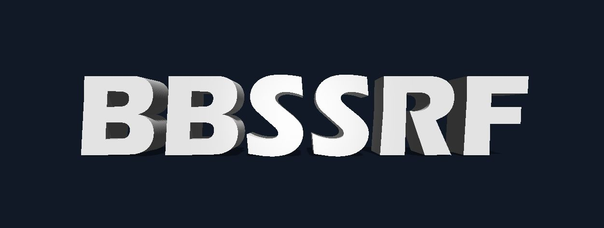

<h1 align=center>
BBSSRF - Bug Bounty SSRF
</h1>


##### Version 1.0

## Summary
BBSSRF - Bug Bounty SSRF is a powerful tool to check SSRF OOB connection.

#### Features
The testing field must contain "BBSSRF" and this tool will automatically change it to dynamically generated payloads.

<ul>
  <li>Generating dynamic payloads</li>
  <li>Testing Single URL </li>
  <li>Testing URLs list </li>
  <li>Testing request file</li>
  <li>Threading requests</li>
  <li>Intercept request using proxy</li>
</ul>


## Installation
```
git clone https://github.com/z3dc0ps/BBSSRF
cd BBSSRF
python bbssrf.py -h
```

## Usage
#### Note - Testing field must be replaced with "BBSSRF"
##### Single URL
```
python3 bbssrf.py -b http://collaborator.com -u http://example.com/index.php?url=BBSSRF
```
##### Multiple URLs
```
python3 bbssrf.py -b http://collaborator.com -f urllist.txt
```
##### Request File
```
python3 bbssrf.py -b http://collaborator.com -r request.req
```
##### STDIN input
```
cat urllist.txt | python3 bbssrf.py -b http://collaborator.com -s
```
##### Proxy
```
python3 bbssrf.py -b http://collaborator.com -r request.req -x http://127.0.0.1:8080
```


### Credit
This tool was inspired by Thomas Houhou's <a href="https://github.com/Th0h0/autossrf/blob/master/autossrf.py">autossrf.py</a>. 


### Thanks to all Contributors
<a href="https://github.com/z3dc0ps/BBSSRF/graphs/contributors">
  
</a>

